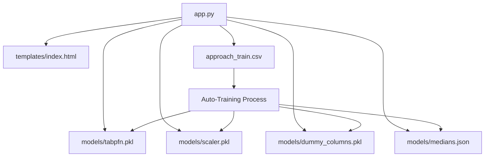

# 📋 Loan App - File Purpose Summary

## 🎯 **What Each File Does**

### **Root Level (Core Application)**
| File | Purpose | Status |
|------|---------|--------|
| `app.py` | **Main Flask web server** - Handles HTTP requests, ML predictions, risk classification | ✅ **CRITICAL** |
| `approach_train.csv` | **Training dataset** - 116K loan records used for model training/retraining | ✅ **CRITICAL** |
| `README.md` | **Project overview** - Quick start guide, API docs, business context | 📚 **INFO** |

### **📁 models/ (ML Artifacts)**
| File | Purpose | Status |
|------|---------|--------|
| `tabpfn.pkl` | **Trained ML model** - RandomForest classifier for default prediction | 🤖 **CRITICAL** |
| `scaler.pkl` | **Feature normalization** - Standardizes numeric inputs (mean=0, std=1) | 🔧 **CRITICAL** |
| `dummy_columns.pkl` | **Feature schema** - Ensures prediction features match training order | 📋 **CRITICAL** |
| `medians.json` | **Missing data handler** - Median values for imputing incomplete inputs | 🔄 **CRITICAL** |

### **📁 templates/ (Web Interface)**
| File | Purpose | Status |
|------|---------|--------|
| `index.html` | **Main web form** - Comprehensive loan application interface (22 fields) | 🌐 **ACTIVE** |
| `index_old.html` | **Legacy form** - Original simple interface (backup/reference) | 📦 **BACKUP** |

### **📁 tests/ (Quality Assurance)**
| File | Purpose | Status |
|------|---------|--------|
| `comprehensive_risk_test.py` | **Full test suite** - Validates all risk levels (Low/Mod/High/Critical) | ✅ **QA** |
| `test_corrected_predictions.py` | **Accuracy tests** - Verifies prediction fix for inverted target variable | 🔍 **QA** |
| `test_moderate_risk.py` | **Edge case testing** - Debugs moderate risk classification | 🎯 **QA** |
| `api_demo.py` | **API examples** - Shows how to use endpoints programmatically | 📡 **DEMO** |

### **📁 docs/ (Documentation)**
| File | Purpose | Status |
|------|---------|--------|
| `README_Enhanced.md` | **Technical guide** - Architecture, model details, developer docs | 👨‍💻 **DEV** |
| `Loan_Risk_Predictor_User_Guide.html` | **User manual** - Screenshots, business guide, step-by-step usage | 👤 **USER** |
| `FILE_STRUCTURE_DOCUMENTATION.md` | **Project organization** - What every file does, dependencies | 📚 **ADMIN** |
| `RESTRUCTURING_SUMMARY.md` | **Change log** - Documents major system improvements | 📝 **HISTORY** |
| `TUTORIAL_*.md` | **Tutorial system docs** - Implementation notes for interactive demos | 🎓 **TUTORIAL** |
| `workflow_diagram.html` | **Visual pipeline** - Interactive diagram of ML workflow | 📊 **VISUAL** |

### **📁 examples/ (Demonstrations)**
| File | Purpose | Status |
|------|---------|--------|
| `tutorial_demo.py` | **Interactive demos** - Generates example scenarios for testing | 🎪 **DEMO** |

---

## 🔥 **Critical Path (Required for Operation)**

1. **`app.py`** → Web server + ML pipeline
2. **`approach_train.csv`** → Training data (fallback if models missing)  
3. **`models/tabpfn.pkl`** → Prediction engine
4. **`models/scaler.pkl`** → Data preprocessing
5. **`models/dummy_columns.pkl`** → Feature alignment
6. **`models/medians.json`** → Missing data handling
7. **`templates/index.html`** → User interface

**⚠️ If ANY of these files are missing or corrupted, the application will not work properly.**

---

## 🛠 **File Dependencies**

---

## 📈 **Usage Priority**

### **Daily Operations**
- `app.py` - Start/stop the web service
- `templates/index.html` - User interface for predictions

### **Development & Testing**  
- `tests/*.py` - Validate functionality
- `examples/tutorial_demo.py` - Generate test scenarios

### **Troubleshooting**
- `docs/README_Enhanced.md` - Technical issues
- `docs/FILE_STRUCTURE_DOCUMENTATION.md` - Understanding system

### **Business Users**
- `docs/Loan_Risk_Predictor_User_Guide.html` - How to use the system
- Web interface at `http://localhost:5002`

---

## 🚨 **Common Issues & Solutions**

| Problem | File to Check | Solution |
|---------|---------------|----------|
| "Model not found" | `models/*.pkl` | Run app.py to auto-train from CSV |
| "Wrong predictions" | `app.py` line 285+ | Check target variable inversion fix |
| "Form validation errors" | `templates/index.html` | Verify input ranges match CSV data |
| "Cannot start server" | `app.py` | Change port or kill existing processes |

**The loan application is now properly organized and documented! 🎉**
