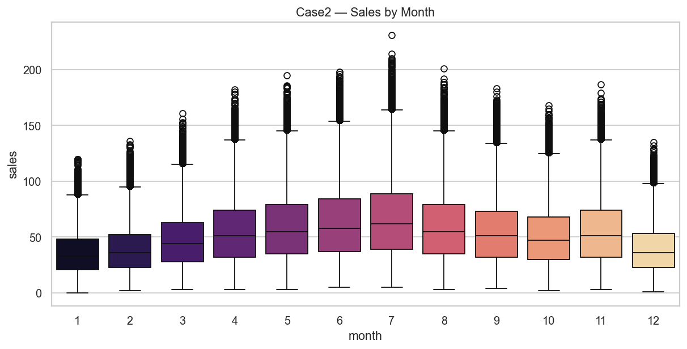

# Samsung Worklet 8 — Unified Flask Dashboard (Full Documentation)

This repository bundles three independent Flask applications behind a single, branded dashboard. The dashboard starts each app on its own port and embeds it so you can operate everything from one place.

- Unified Dashboard: `dashboard/`
- Case2 Sales Prediction (single + batch): `Case2-Nosalesuplift(pipeline) 2/`
- Loan Default Predictor (form): `loan_app/`
- Rossmann Sales Uplift (batch): `Sales Uplift 2/pipeline/`

All apps now share a consistent “Samsung Worklet 8” modern UI.


## 1) Prerequisites

- OS: macOS (zsh shell)
- Python: 3.10+ (3.13 tested)
- Disk space: ~1 GB for Python wheels and models
- Optional: Homebrew for tools like `lsof`

Recommended: Use a dedicated virtual environment in the repo root.


## 2) Setup (macOS + zsh)

Create and activate a venv in the repo root:

```zsh
cd "/Users/ayush/Downloads/Samsung Dashboard worklet 8"
python3 -m venv .venv
source .venv/bin/activate
```

Upgrade pip and install core dependencies used across apps:

```zsh
pip install --upgrade pip
pip install flask pandas numpy scikit-learn joblib xgboost lightgbm catboost
```

Note on Apple Silicon (M1/M2/M3): LightGBM/CatBoost wheels are installed above. If compilation issues appear, reinstall with matching wheels or consult their docs.


## 3) How to Run

You can run everything via the dashboard or run apps individually.

### A. Run the Dashboard (recommended)

```zsh
cd dashboard
python app.py
```

Open: http://127.0.0.1:5050

- Click a button to launch and view each app.
- The dashboard logs child app output to `dashboard/logs/<app>.log`.
- Child apps run with `flask run --no-reload` on these ports:
  - Case2 Sales Prediction: 7001
  - Loan Default Predictor: 7002
  - Rossmann Sales Uplift: 7003

If a button fails, the dashboard shows the last lines from the corresponding log file to help debug quickly.

### B. Run apps individually (direct)

Case2 Sales Prediction:
```zsh
cd "Case2-Nosalesuplift(pipeline) 2"
FLASK_APP=app.py python -m flask run --host 127.0.0.1 --port 7001 --no-reload
```

Loan Default Predictor:
```zsh
cd loan_app
FLASK_APP=app.py python -m flask run --host 127.0.0.1 --port 7002 --no-reload
```

Rossmann Sales Uplift:
```zsh
cd "Sales Uplift 2/pipeline"
FLASK_APP=app.py python -m flask run --host 127.0.0.1 --port 7003 --no-reload
```


## 4) Data, Models, and Artifacts

Each app expects specific artifacts and/or data files. Place them in the listed folders before running.

### A. Case2 Sales Prediction — `Case2-Nosalesuplift(pipeline) 2/`

Purpose: Predict daily sales for a given store+item (single form) and batch CSV upload.

Present artifacts in repo (already included):
- `scaler.pkl` — StandardScaler used to normalize features
- `catboost_model.pkl` — CatBoost regressor
- `lgbm_model.pkl` — LightGBM regressor
- `ridge_model.pkl` — Ridge regressor
- Data files: `train2.csv` (for dropdowns), `test.csv` (sample)

Model selection: UI lets you choose among any loaded models. If doing batch predictions, code prefers `random_forest` if present, else the first loaded model (with current artifacts that will be one of the above).

Features (single prediction):
- Inputs captured: `store`, `item`, `month`, `day`
- Derived at runtime: `dayofweek`, `dayofyear`, `weekofyear`
- All features are scaled by `scaler.pkl` before inference.

Batch prediction (CSV):
- Input CSV must include `date`, `store`, `item`
- The app derives `month`, `day`, `dayofweek`, `dayofyear`, `weekofyear`
- Output CSV adds `predicted_sales` (rounded int)

Endpoints:
- `GET /` — Form + batch UI
- `POST /predict` — Single prediction
- `POST /batch_predict` — CSV upload, returns JSON with `download_url`
- `GET /download/<filename>` — Download processed CSV

### B. Loan Default Predictor — `loan_app/`

Purpose: Classify a loan as Default vs Non-Default from form inputs.

Expected artifacts (user-provided, not committed):
- `loan_app/models/tabpfn.pkl` — Trained classifier (loaded with joblib)
- `loan_app/models/scaler.pkl` — Fitted scaler for numeric features
- `loan_app/models/dummy_columns.pkl` — List of training one-hot columns for alignment

Important: Ensure that the library used to create `tabpfn.pkl` is installed if its class needs to be unpickled (e.g., TabPFN). In many cases, plain scikit-learn-compatible wrappers work with the stack installed above.

Inputs (examples, must match training):
- Numeric: `interest_rate`, …
- Categorical: `source`, `loan_purpose`, `EducationLevel`, `MaritalStatus`, `Gender`, `EmploymentStatus`

Preprocessing:
- One-hot encode categorical columns, then align to `dummy_columns.pkl`
- Scale numeric columns via `scaler.pkl`

Endpoint:
- `GET /` — Applicant form
- `POST /predict` — Returns JSON: `{ "prediction": 0|1, "class": "Default"|"Non-Default" }`

### C. Rossmann Sales Uplift — `Sales Uplift 2/pipeline/`

Purpose: Batch predictions for Rossmann stores using a trained XGBoost model.

Artifacts in repo (already included):
- `xgb_model.pkl` — Trained regressor
- `scaler.pkl` — Scaler fitted on training features
- `encoder.pkl` — OneHotEncoder for categorical features (if present); otherwise a safe dummy encoder is created

Key processing (from `utils/data_processor.py`):
- Type conversions (Date → datetime, encode StateHoliday)
- Feature engineering: `WeekOfYear`, `Month`, `Year`, `CompetitionOpenNumMonths`, `Promo2NumWeeks`
- Transformations: sqrt on `Sales`, `Customers`, `CompetitionOpenNumMonths`, `Promo2NumWeeks`; log on `CompetitionDistance`
- One-hot encoding for `PromoInterval`, `StoreType`, `Assortment` (encoder if available; else pandas dummies)
- Dummy trap avoidance by dropping a fixed set of columns
- Feature order enforced to match scaler’s `feature_names_in_` (or a configured list)

Inputs (CSV):
- A test dataset with standard Rossmann features (no Sales column required)

Outputs:
- JSON: `{ success, row_count, download_url }`
- CSV: Original columns + `Predicted_Sales`

Endpoints:
- `GET /` — CSV upload UI
- `POST /predict` — CSV upload, returns JSON
- `GET /download/<filename>` — Download processed CSV


## 5) API Examples (cURL)

Case2 — single prediction (form post):
```zsh
curl -X POST http://127.0.0.1:7001/predict \
  -H 'Content-Type: application/x-www-form-urlencoded' \
  --data-urlencode 'store=1' \
  --data-urlencode 'item=1' \
  --data-urlencode 'month=1' \
  --data-urlencode 'day=15' \
  --data-urlencode 'model_choice=catboost'
```

Case2 — batch prediction:
```zsh
curl -X POST http://127.0.0.1:7001/batch_predict \
  -F file=@test.csv
```

Loan — predict:
```zsh
curl -X POST http://127.0.0.1:7002/predict \
  -H 'Content-Type: application/x-www-form-urlencoded' \
  --data-urlencode 'interest_rate=9.5' \
  --data-urlencode "EducationLevel=Bachelor's" \
  --data-urlencode 'source=Online' \
  --data-urlencode 'loan_purpose=Personal' \
  --data-urlencode 'MaritalStatus=Single' \
  --data-urlencode 'Gender=Male' \
  --data-urlencode 'EmploymentStatus=Employed'
```

Rossmann — batch prediction:
```zsh
curl -X POST http://127.0.0.1:7003/predict \
  -F file=@"Sales Uplift 2/Dataset/test.csv"
```


## 6) Common Tasks

- Change ports: Edit `APPS` in `dashboard/app.py`.
- Check logs: See `dashboard/logs/*.log` after attempting to start an app.
- Reset uploads: Each app writes outputs under its own `uploads/` folder.
- Re-theme UI: All pages share the same gradient/card style; customize in their HTML `<style>` blocks.


## 7) Troubleshooting (Quick)

- Process died / Bad file descriptor: The dashboard now strips `WERKZEUG_*` env and uses `--no-reload` to avoid FD issues.
- scikit-learn unpickle warnings: Align versions or re-export models. Example to downgrade:
  ```zsh
  pip install 'scikit-learn==1.6.1'
  ```
- Port in use: Free ports with:
  ```zsh
  lsof -ti:5050,7001,7002,7003 | xargs kill -9
  ```
- Missing loan artifacts: Place `tabpfn.pkl`, `scaler.pkl`, `dummy_columns.pkl` under `loan_app/models/`.

See `docs/troubleshooting.md` for detailed guidance.


## 8) Project Layout

```
Samsung Dashboard Worklet 8
├── dashboard/                 # Unified control plane (Flask)
│   ├── app.py                 # Spawns child apps, serves UI, logs
│   ├── logs/                  # Per-app logs
│   └── templates/             # Dashboard views
├── Case2-Nosalesuplift(pipeline) 2/
│   ├── app.py                 # Single & batch sales prediction
│   ├── templates/index.html   # UI (form + batch)
│   ├── *.pkl                  # scaler + models (ridge, lgbm, catboost)
│   └── uploads/               # Batch outputs
├── loan_app/
│   ├── app.py                 # Loan default predictor
│   ├── templates/index.html   # UI (form)
│   └── models/                # EXPECTED: tabpfn.pkl, scaler.pkl, dummy_columns.pkl
└── Sales Uplift 2/pipeline/
    ├── app.py                 # Rossmann batch app
    ├── config.py              # Paths, expected features, upload folder
    ├── utils/                 # Model loader, data processing, file IO
    ├── templates/index.html   # UI (uploader)
    └── uploads/               # Outputs
```


## 9) Security & Production Notes

- This stack is for local demos/dev. Do not expose directly to the internet.
- For production, use a WSGI server (gunicorn/uwsgi) behind a reverse proxy (nginx), configure HTTPS, CSRF protection for forms as needed, and secrets handling.


## 10) Credits

- Flask, Jinja2, Werkzeug
- scikit-learn, XGBoost, LightGBM, CatBoost
- Bootstrap 5, Font Awesome

---

# Executive Summary

This project consolidates three independent ML use cases behind one dashboard:
- No sales prediction (per store–item daily sales; form + batch CSV)
- Loan predictor (delinquency/default classification from applicant features)
- Sales prediction (Rossmann-style retail batch forecasting)

Each use case is a separate Flask app with its own data schema, preprocessing, and model artifacts. The dashboard starts, health-checks, and embeds each app, providing a simple operator interface suitable for demos, reviews, and handover.

Business outcomes:
- Credit risk reduction via early identification of high-risk applicants
- Inventory and operations planning via daily sales estimates
- Campaign and planning support via store-level retail predictions


# Program Context (Samsung PRISM)

Samsung PRISM is a student–industry collaboration program. This worklet follows common data science report conventions for evaluation:
- Clear problem statements and data schemas
- Reproducible modeling approach and evaluation protocol
- Practical deployment interface (web UI) for reviewers


# System Overview

Architecture:
- Three Flask services (one per use case), each loading CSV-based input, applying deterministic preprocessing, running inference with persisted artifacts, and serving a small web UI plus HTTP endpoints
- A unified Flask dashboard that spawns the services on fixed ports, verifies readiness, and embeds each app in an iframe with log-tail diagnostics on failure

Ports (default):
- Dashboard: 5050
- No sales prediction: 7001
- Loan predictor: 7002
- Sales prediction: 7003


# Detailed Use Cases

## A) No sales prediction (Case2)
- Objective: Predict daily sales for a selected store–item and date; also support batch CSV predictions
- Data (single): store (int), item (int), month (1–12), day (1–31)
- Derived features: dayofweek, dayofyear, weekofyear
- Data (batch CSV): columns `date`, `store`, `item` (date features are derived)
- Preprocessing: StandardScaler on [store, item, month, day, dayofweek, dayofyear, weekofyear]
- Models provided: Ridge, LightGBM, CatBoost (choose at runtime)
- Metrics (suggested): MAE/RMSE, MAPE, and error by store/item
- Endpoints: `/`, `POST /predict`, `POST /batch_predict`, `GET /download/<file>`

## B) Loan predictor (delinquency/default)
- Objective: Estimate probability of default for policy cutoffs and monitoring
- Data: numeric (e.g., interest_rate), categorical (source, loan_purpose, EducationLevel, MaritalStatus, Gender, EmploymentStatus) — must match training
- Preprocessing: one-hot encode categoricals, align to `dummy_columns.pkl`, scale numeric features
- Artifacts: `tabpfn.pkl` (classifier), `scaler.pkl`, `dummy_columns.pkl`
- Metrics (suggested): AUC, F1/precision/recall, KS, Brier score, calibration plot; policy threshold tied to expected loss
- Endpoint: `/`, `POST /predict`

## C) Sales prediction (Rossmann batch)
- Objective: Predict sales for many rows to support planning and analytics
- Input CSV: Rossmann-like features (Date, Store, DayOfWeek, Open, Promo, StateHoliday, SchoolHoliday, StoreType, Assortment, CompetitionDistance, etc.) — no Sales column required
- Preprocessing pipeline highlights: engineered time features; Competition/Pomo deltas; sqrt/log transforms; one-hot encoding with encoder fallback; dummy trap handling; feature order aligned to scaler
- Artifacts: `xgb_model.pkl`, `scaler.pkl`, `encoder.pkl`
- Metrics (suggested): MAE/RMSE, segment-wise error; optional uplift-style metrics if experimentation data exists
- Endpoints: `/`, `POST /predict`, `GET /download/<file>`


# API Reference (Consolidated)

## Dashboard
- `GET /` — List apps, status, and Open buttons
- `GET /open/<app_id>` — Launch app on demand and embed it
- `POST /api/start/<app_id>` — Programmatic start
- `POST /api/stop/<app_id>` — Programmatic stop

App IDs: `case2` (No sales prediction), `loan` (Loan predictor), `rossmann` (Sales prediction)

## No sales prediction (Case2)
- `GET /` — HTML (form + batch)
- `POST /predict` — Single prediction (form fields: store, item, month, day, model_choice)
- `POST /batch_predict` — Multipart CSV (file)
- `GET /download/<filename>` — CSV download

## Loan predictor
- `GET /` — Form
- `POST /predict` — x-www-form-urlencoded; returns JSON `{ prediction, class }`

## Sales prediction (Rossmann)
- `GET /` — Uploader
- `POST /predict` — Multipart CSV (file); returns `{ success, row_count, download_url }`
- `GET /download/<filename>` — CSV download


# Data Management & Reproducibility

Quality controls:
- De-duplication by keys (e.g., (store, item, date) or applicant ID)
- Missing value policy consistent between train and inference
- Outlier treatment (clipping/winsorization, log transforms)
- Encoding strategies documented for categorical fields
- Consistent splits with seeded randomness

Dataset documentation (per CSV):
- Column name, type, allowed ranges, missingness, meaning, label definition, and leakage prevention notes

Reproducibility:
- Pin Python and package versions
- Persist random seeds and training configs
- Store scalers/encoders with models; enforce feature order (e.g., `scaler.feature_names_in_`)


# Model Evaluation Protocol

- Classification (loan): stratified k-fold; report mean ± std for AUC/F1/etc.; final holdout
- Regression (sales): k-fold or time-aware split; report MAE/RMSE, error histograms and segments
- Thresholding: choose policy cutoffs based on cost/benefit and calibration; document rationale
- Overfitting checks: learning curves, validation gaps, SHAP/feature importance stability, drift checks


# Dashboard Design & UX

- Single page with three primary actions: open No sales prediction, Loan predictor, or Sales prediction
- Each app page: KPI strip (e.g., AUC, RMSE), a couple of charts (ROC/uplift/error), CSV uploader or form, and data preview
- Theme: “Samsung Worklet 8” gradient cards and headers; embedded logs for quick debugging


# Implementation Details

Tech stack:
- Python 3.x, Flask for all apps
- ML: scikit-learn, XGBoost, LightGBM, CatBoost
- Data: pandas, numpy
- Dashboard alternatives: Streamlit/Dash/Taipy (optional future migration)

Run locally (recommended):
```zsh
cd "/Users/ayush/Downloads/Samsung Dashboard worklet 8"
python3 -m venv .venv && source .venv/bin/activate
pip install --upgrade pip && pip install flask pandas numpy scikit-learn joblib xgboost lightgbm catboost
cd dashboard && python app.py
```
Open http://127.0.0.1:5050 and click to open each app.


# Results & Impact (Template)

- No sales prediction: MAE/RMSE on holdout, error by store/item, planning guidance
- Loan predictor: AUC/ROC, KS, calibration; policy thresholds tied to expected loss
- Sales prediction: MAE/RMSE, segment-wise error; planning/campaign insights

Include screenshots of each app view and an example CSV-to-prediction flow for reviewers.


# Troubleshooting (Quick)

- Startup failures: check `dashboard/logs/<app>.log` and free ports: `lsof -ti:5050,7001,7002,7003 | xargs kill -9`
- scikit-learn pickle warnings: align versions or re-export models
- Missing loan artifacts: add `tabpfn.pkl`, `scaler.pkl`, `dummy_columns.pkl` under `loan_app/models/`


# Limitations & Next Steps

- Class imbalance (loan) and feature drift risks (all)
- CSV IO for demo; migrate to Parquet or an RDBMS for production-like setups
- Add model cards, automated data checks in CI, periodic retraining with monitoring
- Optional migration to Streamlit/Dash/Taipy for richer analytics displays


# Credits

- Flask, Jinja2, Werkzeug
- scikit-learn, XGBoost, LightGBM, CatBoost
- Bootstrap 5, Font Awesome

---

## Visual Overview

<p align="center">
  
</p>

<p align="center">
  
</p>

<p align="center">
  <a href="#how-to-run"></a>
  <a href="#data-models-and-artifacts"></a>
  <a href="#troubleshooting-quick"></a>
</p>

---

## Table of Contents

- [Prerequisites](#1-prerequisites)
- [Setup](#2-setup-macos--zsh)
- [How to Run](#3-how-to-run)
- [Data, Models, and Artifacts](#4-data-models-and-artifacts)
- [API Examples](#5-api-examples-curl)
- [Use-Case Walkthroughs](#use-case-walkthroughs)
- [Architecture](#architecture-diagram)
- [Screenshots and Charts](#screenshots-and-charts)
- [Troubleshooting](#7-troubleshooting-quick)

---

## Use-Case Walkthroughs

### No sales prediction (Case2)

How it runs (UI and API):
- Open Dashboard → click “No sales prediction” → form page loads
- Fill store, item, date → click Predict → server derives date features, scales, selects model → returns prediction
- For batch: upload CSV with date, store, item → receive download link

Mermaid sequence (form flow):


Sample prediction (single):
```text
Predicted Sales with Catboost: 184
```

Sample JSON (batch):
```json
{
  "success": true,
  "download_url": "/download/predictions_test.csv",
  "records_processed": 1000
}
```

Tips:
- Ensure scaler.pkl and at least one model .pkl exist in the Case2 folder
- The dropdown list is populated from train2.csv (store/item values)

---

### Loan predictor (delinquency/default)

How it runs:
- Open Dashboard → click “Loan predictor” → applicant form
- Submit → server one-hot encodes categoricals, aligns to dummy_columns.pkl, scales numerics, predicts class

Mermaid sequence:


Sample JSON:
```json
{ "prediction": 1, "class": "Default" }
```

Tips:
- Place tabpfn.pkl, scaler.pkl, dummy_columns.pkl into loan_app/models/
- Column names in the form must match training-time schema for proper alignment

---

### Sales prediction (Rossmann batch)

How it runs:
- Open Dashboard → click “Sales prediction” → CSV uploader
- Upload Rossmann-style feature CSV → pipeline processes features, scales, predicts → download link returned

Mermaid sequence:


Sample JSON:
```json
{ "success": true, "row_count": 42157, "download_url": "/download/predictions_test.csv" }
```

Tips:
- encoder.pkl is optional; a safe OneHotEncoder fallback is created if missing
- scaler.feature_names_in_ is used to enforce feature order; otherwise Config.EXPECTED_FEATURES

---

## Architecture Diagram

```mermaid
flowchart LR
  subgraph Dashboard[Unified Dashboard (Flask)]
    A[Buttons: No sales | Loan | Sales] -->|spawn + health check| P1
  end
  subgraph Case2[No sales prediction]
    P1[flask run 7001] --> F1[Form + Batch]
    F1 --> M1[Scaler + Ridge/LGBM/CatBoost]
  end
  subgraph Loan[Loan predictor]
    P2[flask run 7002] --> F2[Applicant Form]
    F2 --> M2[Dummy Align + Scaler + Classifier]
  end
  subgraph Rossmann[Sales prediction]
    P3[flask run 7003] --> F3[CSV Upload]
    F3 --> M3[DataProcessor + Scaler + XGBoost]
  end
  A -. iframe .-> F1
  A -. iframe .-> F2
  A -. iframe .-> F3
```

---

## Screenshots and Charts

- Dashboard: add your own screenshot to `docs/assets/dashboard.png` (placeholder)
- No sales (form): add to `docs/assets/no_sales_form.png` (placeholder)
- No sales (batch success): add to `docs/assets/no_sales_batch.png` (placeholder)
- Loan predictor (form): add to `docs/assets/loan_form.png` (placeholder)

Real charts generated from your data:

<p align="center">
  
  
</p>

<p align="center">
  
</p>

<p align="center">
  
</p>

<p align="center">
  
</p>

### Example Metric Visuals (placeholders)


---

## Prediction Galleries

<details>
  <summary><b>No sales — Single Prediction Examples</b></summary>

```text
Store 1, Item 1, 2024-01-15 → 184
Store 12, Item 3, 2024-02-02 → 97
Store 5, Item 8, 2024-07-21 → 236
```
</details>

<details>
  <summary><b>Loan predictor — JSON Responses</b></summary>

```json
{ "prediction": 0, "class": "Non-Default" }
{ "prediction": 1, "class": "Default" }
```
</details>

<details>
  <summary><b>Sales prediction — Batch Results (CSV head)</b></summary>

```csv
...,Store,Date,DayOfWeek,Open,Promo,...,Predicted_Sales
...,1,2015-08-01,6,1,1,...,4570
...,1,2015-08-02,7,0,1,...,0
```
</details>

---

## Pro Tips for a Slick Demo

- Record a short GIF clicking the three buttons and downloading a CSV (`docs/assets/demo.gif`).
- Keep ports free before presenting: `lsof -ti:5050,7001,7002,7003 | xargs kill -9`.
- Warm the venv and dependencies ahead of time to avoid cold-start delays.

---

## Attributions & Theme

- Theme: gradient (#667eea → #764ba2), consistent cards, Samsung Worklet 8 navbars
- Icons: Font Awesome; Charts: Mermaid (rendered by GitHub)
- ML Stack: scikit-learn, XGBoost, LightGBM, CatBoost

---

<p align="center">
  <sub>Samsung PRISM — Unified Python Dashboard • © 2025</sub>
</p>
