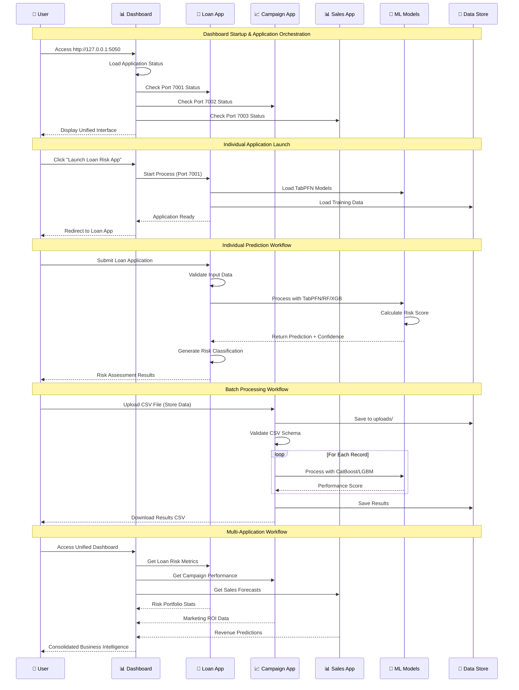
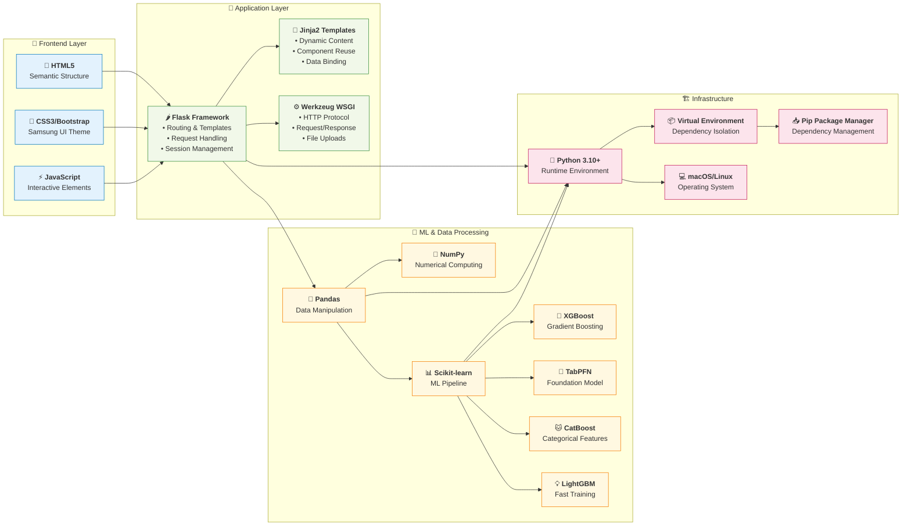
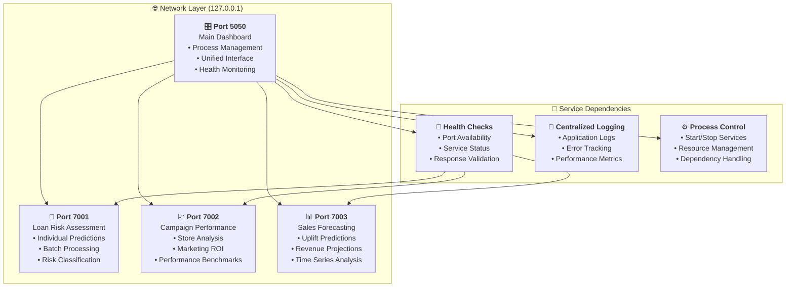

# 🏗️ PRISM Worklet 8 - Complete System Architecture

```mermaid
graph TB
    %% === USER INTERFACE LAYER ===
    subgraph "👥 User Interface Layer"
        WEB["`🌐 **Web Browser**
        Chrome/Firefox/Safari`"]
        
        MOBILE["`📱 **Mobile Interface**
        Responsive Design`"]
        
        API_CLIENT["`🔗 **API Clients**
        cURL/Postman/Python`"]
    end
    
    %% === DASHBOARD ORCHESTRATION ===
    subgraph "🎛️ Dashboard Orchestration (Port 5050)"
        DASH_APP["`📊 **Main Dashboard**
        Flask Application
        • Unified Control Panel
        • Application Management
        • Process Orchestration`"]
        
        DASH_ROUTES["`🔀 **Dashboard Routes**
        / → Main Interface
        /open/<app> → Launch Apps
        /api/start → Start Services
        /api/stop → Stop Services`"]
        
        PROC_MGR["`⚙️ **Process Manager**
        • Subprocess Control
        • Port Management
        • Health Monitoring
        • Log Aggregation`"]
        
        DASH_LOGS["`📝 **Log Manager**
        logs/loan.log
        logs/campaign.log
        logs/sales.log`"]
    end
    
    %% === CORE AI APPLICATIONS ===
    subgraph "🤖 Core AI Applications"
        %% LOAN RISK APPLICATION
        subgraph "🏦 Loan Delinquency Risk (Port 7001)"
            LOAN_APP["`💰 **Flask App**
            Risk Assessment Engine`"]
            
            LOAN_MODELS["`🧠 **ML Models**
            • TabPFN Foundation Model
            • Random Forest Ensemble
            • XGBoost Classifier
            • SVM Risk Scorer`"]
            
            LOAN_API["`🔌 **API Endpoints**
            / → Risk Form
            /predict → Individual Assessment
            /batch → Bulk Processing`"]
            
            LOAN_DATA["`📊 **Data Layer**
            • approach_train.csv (116K records)
            • models/ (TabPFN, Scaler, Encoder)
            • Feature Engineering Pipeline`"]
        end
        
        %% CAMPAIGN PERFORMANCE APPLICATION  
        subgraph "📈 Campaign Performance (Port 7002)"
            CAMP_APP["`📊 **Flask App**
            Marketing Analytics Engine`"]
            
            CAMP_MODELS["`🧠 **ML Models**
            • CatBoost Regressor
            • LightGBM Ensemble
            • Ridge Regression
            • TabPFN Integration`"]
            
            CAMP_API["`🔌 **API Endpoints**
            / → Performance Dashboard
            /predict → Store Analysis
            /upload → Batch Analysis`"]
            
            CAMP_DATA["`📊 **Data Layer**
            • train2.csv (Store Performance)
            • test_store_performance.csv
            • Model Artifacts (CatBoost, LGBM, Ridge)`"]
        end
        
        %% SALES FORECASTING APPLICATION
        subgraph "📊 Sales Uplift Forecasting (Port 7003)"
            SALES_APP["`📈 **Flask App**
            Sales Prediction Engine`"]
            
            SALES_MODELS["`🧠 **ML Models**
            • XGBoost Forecaster
            • Time Series Analysis
            • Feature Engineering
            • Uplift Calculation`"]
            
            SALES_API["`🔌 **API Endpoints**
            / → Forecast Interface
            /predict → Sales Prediction
            /upload → Batch Forecasting`"]
            
            SALES_DATA["`📊 **Data Layer**
            • train.csv (Historical Sales)
            • store.csv (Store Metadata)
            • Encoder/Scaler Pipeline`"]
        end
    end
    
    %% === FOUNDATION LAYER ===
    subgraph "🔧 Foundation & Infrastructure"
        subgraph "🐍 Python Runtime Environment"
            PYTHON["`🐍 **Python 3.10+**
            Virtual Environment
            • Flask Framework
            • Pandas/NumPy
            • Scikit-learn
            • XGBoost/LightGBM/CatBoost`"]
            
            TABPFN["`🚀 **TabPFN Foundation**
            Advanced Tabular ML
            • Pre-trained Models
            • Zero-shot Learning
            • Feature Automation`"]
        end
        
        subgraph "💾 Data Storage"
            CSV_DATA["`📄 **CSV Datasets**
            • Training Data
            • Test Data  
            • Sample Data`"]
            
            MODEL_STORE["`🗃️ **Model Artifacts**
            • .pkl Model Files
            • Scalers & Encoders
            • Feature Schemas
            • Metadata`"]
            
            UPLOADS["`📤 **Upload Storage**
            • User CSV Files
            • Batch Processing
            • Temporary Data`"]
        end
        
        subgraph "📊 Analytics & Logging"
            LOGS["`📝 **Application Logs**
            • Debug Information
            • Performance Metrics
            • Error Tracking`"]
            
            DEMO_LOGS["`📋 **Demo Scripts**
            • Inference Testing
            • Health Monitoring
            • Integration Validation`"]
        end
    end
    
    %% === DOCUMENTATION & VISUALIZATION ===
    subgraph "📚 Documentation & Visual Assets"
        VIS_DOCS["`🎨 **Visual Documentation**
        Visual Documentation & Schematics/
        • Interactive Diagrams
        • System Flows
        • API Sequences
        • Architecture Guides`"]
        
        README_DOCS["`📖 **README Documentation**
        • Main Project Guide
        • Individual App READMEs
        • Samsung Mentors Guide
        • Setup Instructions`"]
        
        DEMO_SCRIPTS["`🔬 **Inference Scripts**
        • loan_risk_inference_demo.py
        • campaign_performance_inference_demo.py
        • sales_uplift_inference_demo.py`"]
    end
    
    %% === EXTERNAL INTEGRATIONS ===
    subgraph "🌐 External Integration Points"
        SAMSUNG_API["`🏢 **Samsung Systems**
        Future Integration Points
        • Enterprise APIs
        • Data Warehouses
        • Business Intelligence`"]
        
        CLOUD_DEPLOY["`☁️ **Cloud Deployment**
        Production Ready
        • AWS/Azure Integration
        • Docker Containerization
        • Kubernetes Orchestration`"]
    end
    
    %% === CONNECTION FLOWS ===
    
    %% User Interface Connections
    WEB --> DASH_APP
    MOBILE --> DASH_APP
    API_CLIENT --> LOAN_API
    API_CLIENT --> CAMP_API
    API_CLIENT --> SALES_API
    
    %% Dashboard Orchestration Flows
    DASH_APP --> DASH_ROUTES
    DASH_ROUTES --> PROC_MGR
    PROC_MGR --> LOAN_APP
    PROC_MGR --> CAMP_APP
    PROC_MGR --> SALES_APP
    PROC_MGR --> DASH_LOGS
    
    %% Application Internal Flows
    LOAN_APP --> LOAN_API
    LOAN_API --> LOAN_MODELS
    LOAN_MODELS --> LOAN_DATA
    
    CAMP_APP --> CAMP_API
    CAMP_API --> CAMP_MODELS
    CAMP_MODELS --> CAMP_DATA
    
    SALES_APP --> SALES_API
    SALES_API --> SALES_MODELS
    SALES_MODELS --> SALES_DATA
    
    %% Foundation Connections
    LOAN_APP --> PYTHON
    CAMP_APP --> PYTHON
    SALES_APP --> PYTHON
    
    LOAN_MODELS --> TABPFN
    CAMP_MODELS --> TABPFN
    
    LOAN_DATA --> CSV_DATA
    LOAN_DATA --> MODEL_STORE
    CAMP_DATA --> CSV_DATA
    CAMP_DATA --> MODEL_STORE
    SALES_DATA --> CSV_DATA
    SALES_DATA --> MODEL_STORE
    
    %% File Upload Flows
    LOAN_API --> UPLOADS
    CAMP_API --> UPLOADS
    SALES_API --> UPLOADS
    
    %% Logging Flows
    DASH_APP --> LOGS
    LOAN_APP --> LOGS
    CAMP_APP --> LOGS
    SALES_APP --> LOGS
    
    %% Demo & Documentation Connections
    DEMO_SCRIPTS --> LOAN_APP
    DEMO_SCRIPTS --> CAMP_APP
    DEMO_SCRIPTS --> SALES_APP
    DEMO_SCRIPTS --> DEMO_LOGS
    
    %% Future Integration
    DASH_APP -.-> SAMSUNG_API
    PYTHON -.-> CLOUD_DEPLOY
    
    %% === STYLING ===
    classDef userLayer fill:#e1f5fe,stroke:#01579b,stroke-width:2px
    classDef dashboardLayer fill:#f3e5f5,stroke:#4a148c,stroke-width:2px
    classDef appLayer fill:#e8f5e8,stroke:#1b5e20,stroke-width:2px
    classDef foundationLayer fill:#fff3e0,stroke:#e65100,stroke-width:2px
    classDef docLayer fill:#fce4ec,stroke:#880e4f,stroke-width:2px
    classDef externalLayer fill:#f1f8e9,stroke:#33691e,stroke-width:2px
    
    class WEB,MOBILE,API_CLIENT userLayer
    class DASH_APP,DASH_ROUTES,PROC_MGR,DASH_LOGS dashboardLayer
    class LOAN_APP,LOAN_MODELS,LOAN_API,LOAN_DATA,CAMP_APP,CAMP_MODELS,CAMP_API,CAMP_DATA,SALES_APP,SALES_MODELS,SALES_API,SALES_DATA appLayer
    class PYTHON,TABPFN,CSV_DATA,MODEL_STORE,UPLOADS,LOGS,DEMO_LOGS foundationLayer
    class VIS_DOCS,README_DOCS,DEMO_SCRIPTS docLayer
    class SAMSUNG_API,CLOUD_DEPLOY externalLayer
```

## 🔄 Data Flow Architecture

## 🏗️ Technical Stack Architecture

## 📊 Port & Service Architecture

---

**🏆 PRISM Worklet 8 - Advanced AI Platform Architecture**  
*Preparing and Inspiring Student Minds*

This comprehensive architecture diagram shows the complete system structure, data flows, technical stack, and service dependencies for the Samsung PRISM Worklet 8 project.
